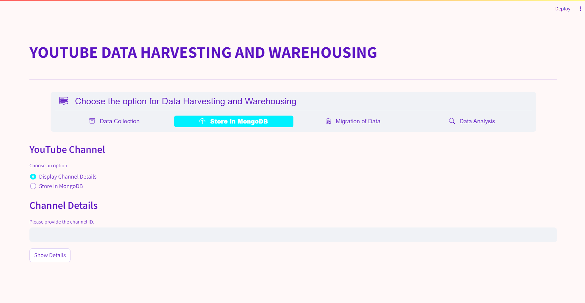
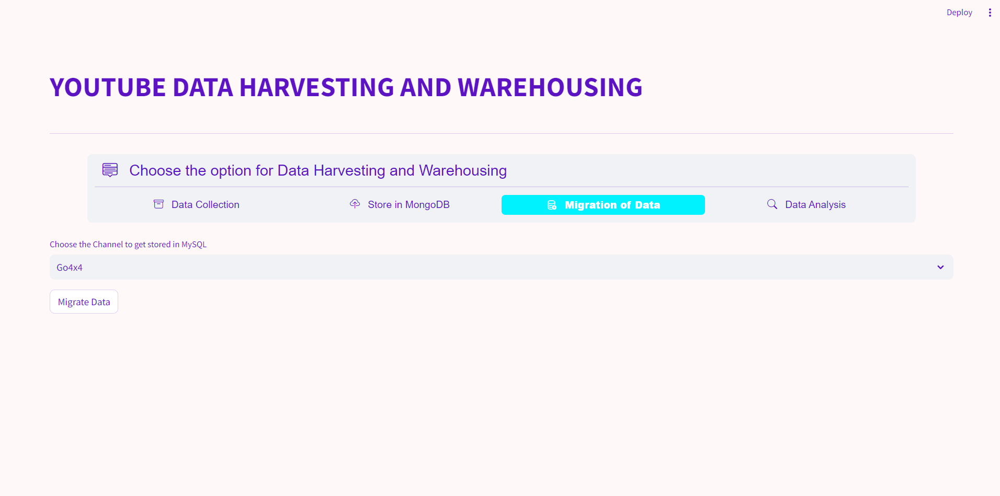
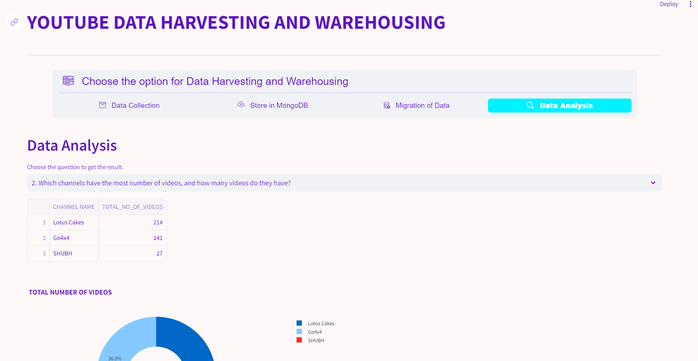

# YOUTUBE DATA HARVESTING AND WAREHOUSING #

## DESCRIPTION ##
The objective of this project is to create a user-friendly Streamlit application that utilizes the Google API to retrieve data from a YouTube channel. The extracted information will be stored in a MongoDB database, then migrated to a SQL data warehouse. Users will have the ability to search for channel details and join tables to visualize data within the Streamlit application.

## REQUIREMENTS ##
All necessary packages for pip installation are listed in the requirements.txt file. Prior to executing the program, establish a virtual environment and use pip to install all required packages specified in the requirement.txt file.

## STREAMLIT APPLICATION PREVIEW ##

