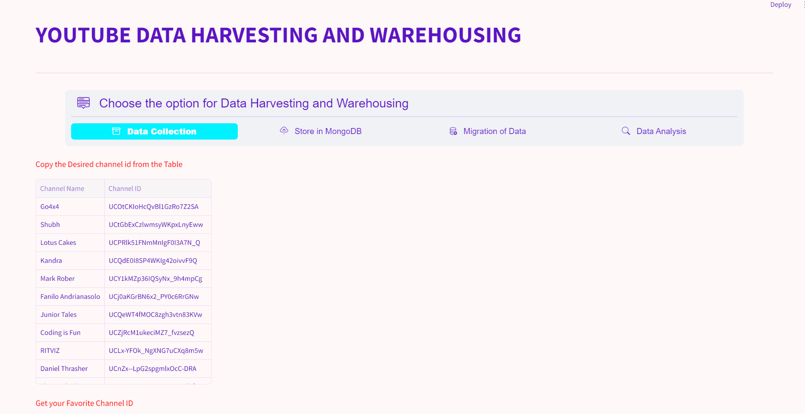

# YOUTUBE DATA HARVESTING AND WAREHOUSING #

## DESCRIPTION ##
This project aims to develop a user-friendly Streamlit application that utilizes the Google API to extract information on a YouTube channel, stores it in a MongoDB database, migrates it to a SQL data warehouse, and enables users to search for channel details and join tables to view data in the Streamlit app.

## Configuration: ##

1.Open the Capstone1.py file in the project directory.

2.Set the desired configuration options:

3.Specify your YouTube API key.

4.Choose the database connection details (SQL and MongoDB).

5.Get the Youtube Channel ID from the Youtube's sourcepage

6.provide the Youtube Channel ID data to be harvested.

7.Set other configuration options as needed.

## REQUIREMNETS ##
All necessary packages for pip installation are listed in the requirements.txt file. Prior to executing the program, establish a virtual environment and use pip to install all required packages specified in the requirement.txt file.

## STREAMLIT APPLICATION PREVIEW ##

